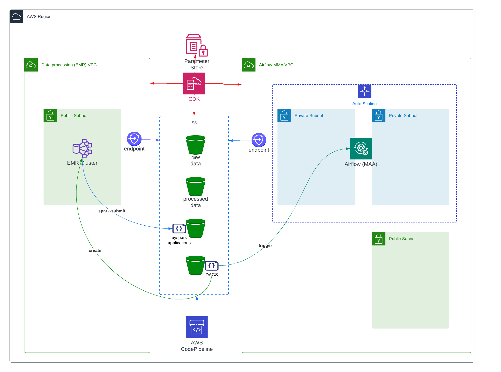

# Data Pipeline Capstone



---

## Summary
This is a capstone project for a data engineering nanodegree.  The purpose of this capstone is to correlate and integrate US immigration data and global temperature data.  

The outcome is that wihtout more data gathering the data can only be correlated over certain US destinations and joined at the country level as opposed to city and state, but within that scope the data can be "joined".  That is not to say that there is a real correlation between immigration and climate, only that the data sets can be joined and reported.


``` This page provides a template of the points we need to cover -- the actual documentation is in the LINKS below in each section.```


> Github
> https://github.com/cjlcoursework/udacity-capstone-project.git

### The project
- This document is a table of contents - the actual documentation is provided in the links below
- I am using the i94immigration project, but changing the input from the static snapshots provided to "fake" raw data 
  - The goal is the have a dataset that grows periodically and is stored parameterized By year/month/day
  - So this 'pretend' data will be pre-processed csv data that I'll copy into the raw bucket in s3
  - The solution STARTS with the raw data in s3, not the 'real" sas, and global temp -- I preformat that data locally using pyspark

### Goals
- The functional goal is to transform the "raw" data in s3 to a processed folder 
- The analytical output is a full join between immigration and temperature data that can be used in a BI tool
  - I did not want to spend a loto of time getting screenshots from Tableau


### Approach
- The solution uses:
  1. CDK to build the AWS resources and upload code to s3
  2. pyspark on EMR
  3. Managed Airflow (MAA) in AWS
  4. DAGS to create EMR, 
  5. data stored in s3
  6. dags, pyspark applications are uploaded to s3


### Deployment Overview
Most of this information is covered in more depth below.
This document provides a higher level overview of the overall ETL stack and the steps taken to get from raw data to Athena

* documentation: [deployment steps](doc/deployment-screenshots.md)


### Supporting documents

* documentation: [Contents of this repo](doc/step1.capstone-repo.md)

* documentation:  [Terms](doc/terms.md)

* documentation: [Resources and Credits](doc/resources.md)

* documentation: [Open to-do](doc/todo.py)

---


### Step 1: Scope the Project and Gather Data
- Identify and gather the data you'll be using for your project (at least two sources and more than 1 million rows). See Project Resources for ideas of what data you can use.
- Explain what end use cases you'd like to prepare the data for (e.g., analytics table, app back-end, source-of-truth database, etc.)


* documentation:   [scope of the project](doc/step1.scope.md)

---

### Step 2. Explore and Assess the Data
- Explore the data to identify data quality issues, like missing values, duplicate data, etc.
- Document steps necessary to clean the data


* documentation:   
  * [Data exploration](doc/step2.explore.md)
  
  * [Immigration cleanup notes](doc/step2.labnotes1.md)

  * [Defect cleanup details](doc/step2.labnotes2.md)
---

### Step 3: Define the Data Model
- Map out the conceptual data model and explain why you chose that model
- List the steps necessary to pipeline the data into the chosen data model


* documentation:   [Definition of the data](doc/step3.define.md)

* documentation:  [Data dictionary](doc/data_dictionary.md)

---

### Step 4: Run ETL to Model the Data
- Create the data pipelines and the data model
- Include a data dictionary
- Run data quality checks to ensure the pipeline ran as expected
- Integrity constraints on the relational database (e.g., unique key, data type, etc.)
- Unit tests for the scripts to ensure they are doing the right thing
- Source/count checks to ensure completeness


* documentation:
  - [Architecture](doc/step4.architecture.md)

  - [Deployment Overview](doc/step4.deployment.md)
  
  - [Deployment Steps Republished](doc/deployment-screenshots.md)

  - [The data pipeline](doc/step4.pipeline.md)

  - [Base query](doc/step4.proof-of-concept.md)

---


### Step 5: Complete Project Write Up
- What's the goal? What queries will you want to run? How would Spark or Airflow be incorporated? Why did you choose the model you chose?
- Clearly state the rationale for the choice of tools and technologies for the project.
- Document the steps of the process.
- Propose how often the data should be updated and why.
- Post your write-up and final data model in a GitHub repo.
- Include a description of how you would approach the problem differently under the following scenarios:
  - If the data was increased by 100x.
  - If the pipelines were run on a daily basis by 7am.
  - If the database needed to be accessed by 100+ people.


* documentation:  [Write up](doc/step5.write_up.md)


