# Deployment Steps

This document outlines the steps taken to deploy the solution in AWS.

---

# Steps Taken

## Run CDK from Local IDE
Used CDK to deploy all of the resources to ETL from raw tables to processed table.
The CDK is a pure code solution that:
1. Allows a developer to define the stack using Python, Node, Go, or Java code
2. Synthesizes Cloudformation Stacks
3. Runs the Stacks and monitors for completion

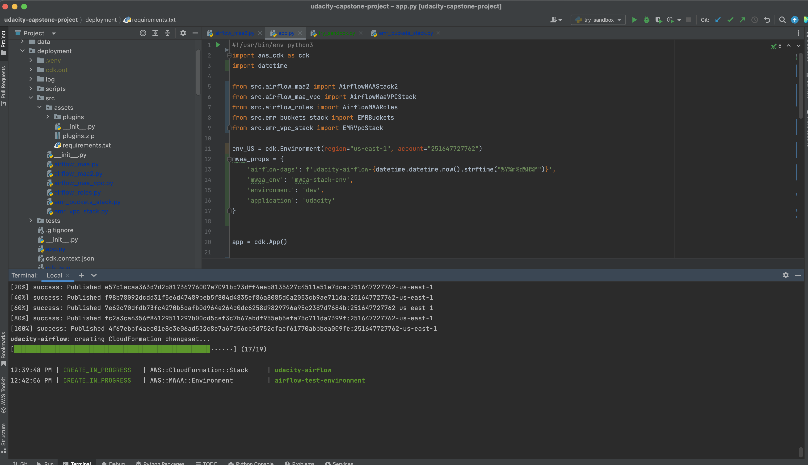

---

## Cloudformation stacks created
CDK creates and runs Cloudformation stacks and runs them, waiting until the CF stacks are fully executed

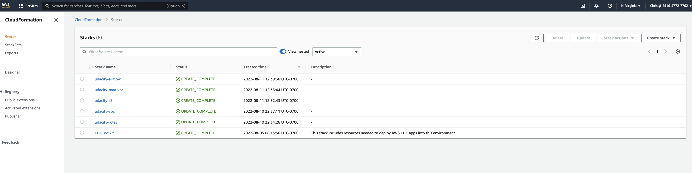

---

## Buckets created by CDK
CDK created the following buckets to support, raw data, log buckets, application and DAG data uploaded to s3

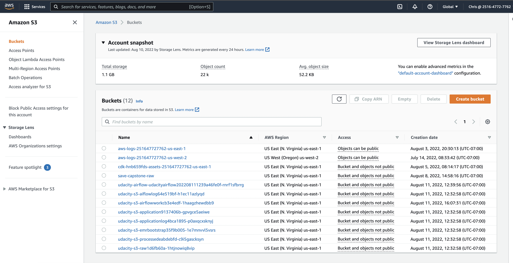

---

## DAGS sub-folder
DAG data was uploaded to s3 by CDK

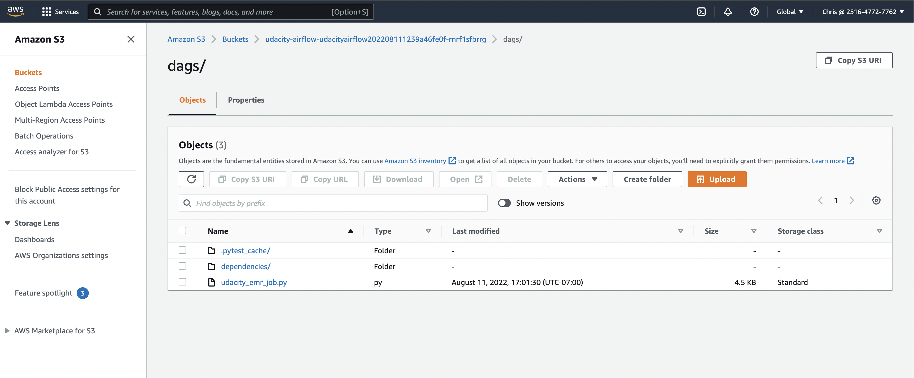
---

## Pyspark apps subfolder
pyspark applications were uploaded to s3 by CDK

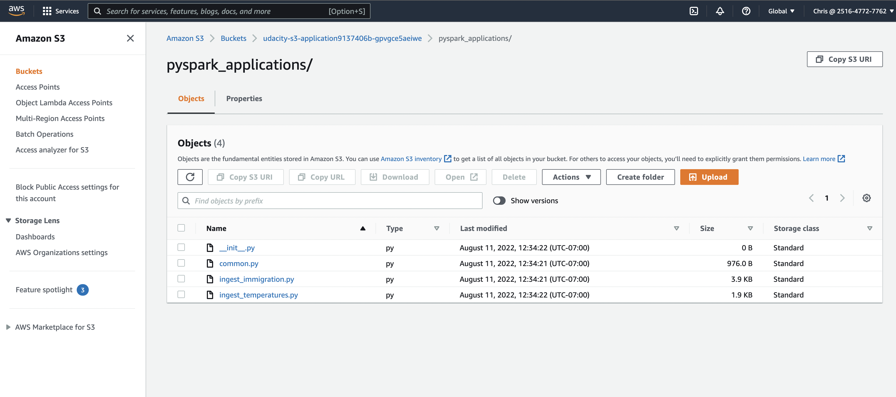

---

## ParameterStore Parameters created
As we create AWS resources, we add the information to the AWS Systems Manager Parameter Store


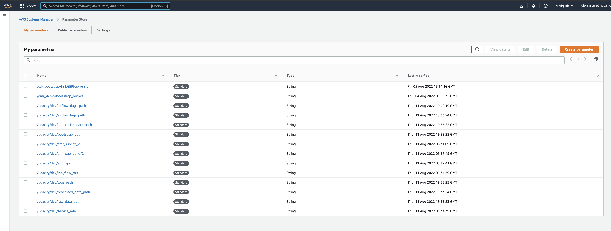

---

## Managed Airflow DAGS
The CDK spins up a Managed Airflow instance (MAA) that uses Dags and Plugins located in S3 are picked up by AWS managed Airflow 

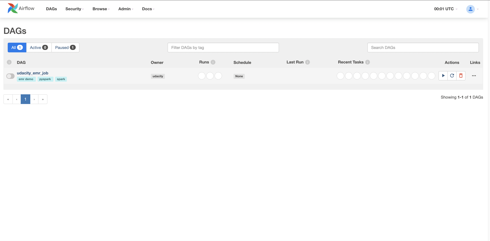

---

## Airflow Job Graph
There is a single DAG, but it deploys both immigration and temperature as a part of the "STEPS" list passedin into the 


```python
# EMR Steps are passed into the add_steps task -- both ETLS are run in parallel
EMR_STEPS=[
    {
        "Name": "Immigration ETL",
        "ActionOnFailure": "CONTINUE",
        "HadoopJarStep": {
            "Jar": "command-runner.jar",
            "Args": [
                "spark-submit",
                "--deploy-mode",
                "cluster",
                "--master",
                "yarn",
                "--conf",
                "spark.yarn.submit.waitAppCompletion=true",
                "https://udacity-s3-application9137406b-gpvgce5aeiwe.s3.amazonaws.com/pyspark_applications/ingest_immigration.py"
            ]
        }
    },
    {
        "Name": "Temperature ETL",
        "ActionOnFailure": "CONTINUE",
        "HadoopJarStep": {
            "Jar": "command-runner.jar",
            "Args": [
                "spark-submit",
                "--deploy-mode",
                "cluster",
                "--master",
                "yarn",
                "--conf",
                "spark.yarn.submit.waitAppCompletion=true",
                "https://udacity-s3-application9137406b-gpvgce5aeiwe.s3.amazonaws.com/pyspark_applications/ingest_temerature.py"
            ]
        }
    },
]

```

---

#### Airflow Tree View

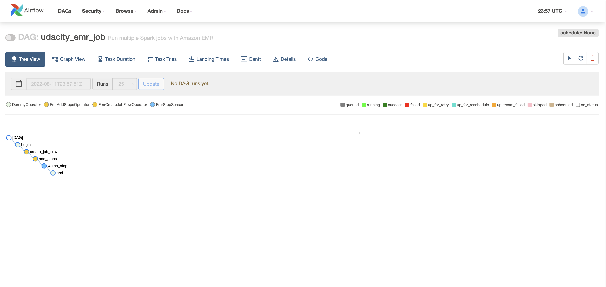

---

## Airflow Graph View

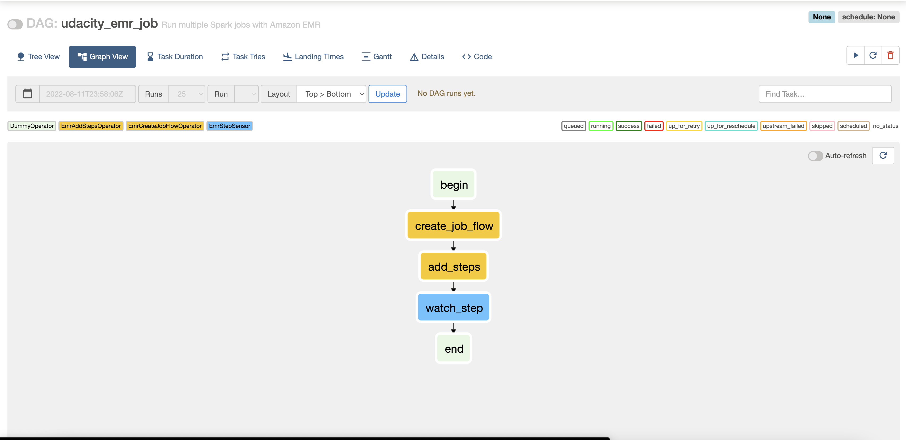

---

## Processed Data
Once the job is complete the data from the raw bucket is transformed into the processed bucket
- Raw and Processed data 
* aws s3 ls raw:       [raw data files](raw.dump)
* aws s3 ls processed: [processed data files](processed.dump)

---

## AWS Glue Tabel Definitions
Once the parquet data is available in S3, we can enter the schemas and table names intp Glue.  

#### Immigration Table definition
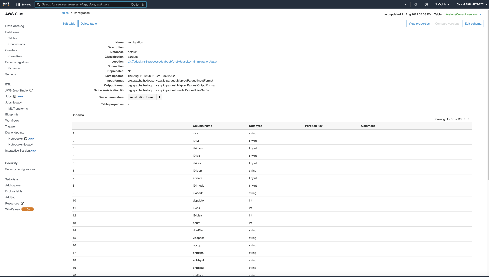

#### Temperature Table definition
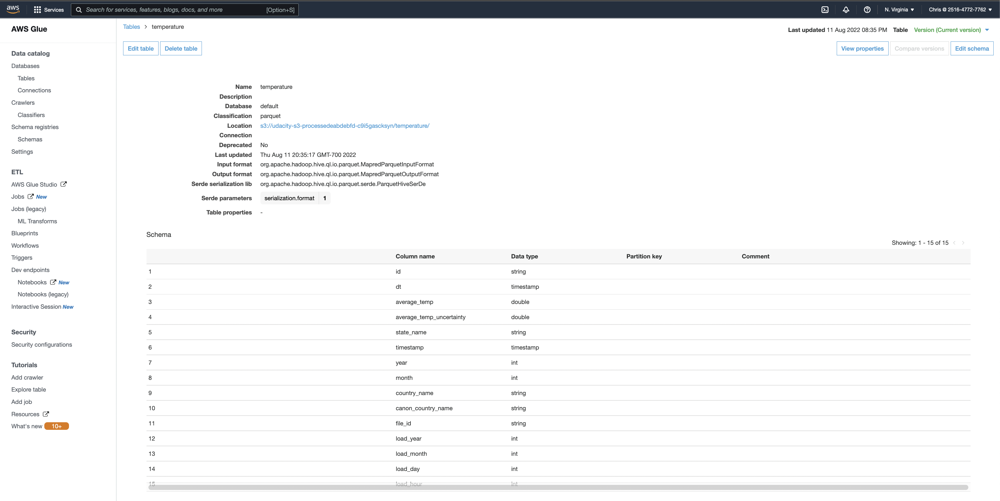


---

## Athena Query Immigration
At this point the data is available in AWS Athena 

#### immigration table
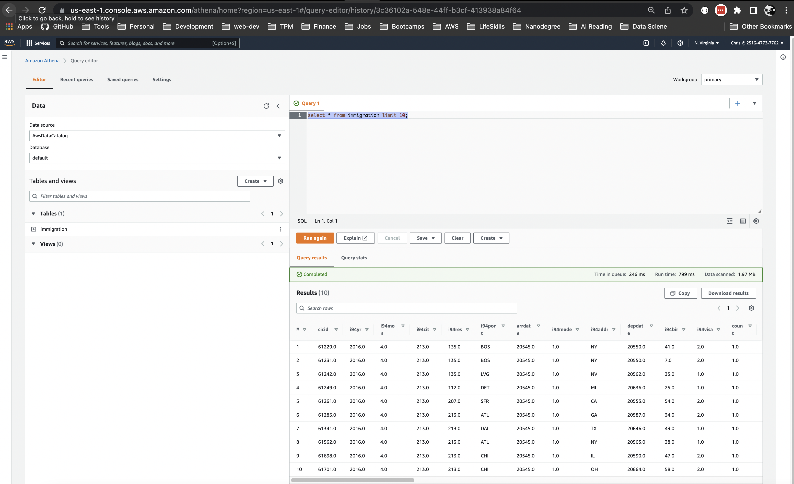

#### temperature table
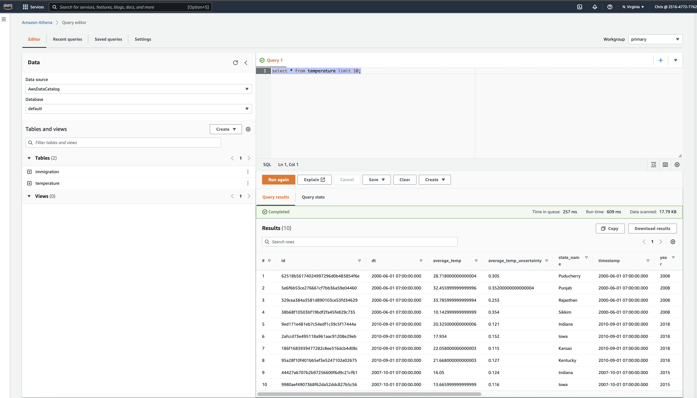

---

## Athena Join Immigrations with Temperatures
At this point we can join the data and provide a curated pivoted table to data analysts and BI tools.

```sql
WITH country_temps as (
	select canon_country_name,
		year,
		month,
		avg(average_temp) as avg_temp
	from temperature
	group by canon_country_name,
		year,
		month
)
select DISTINCT I.year as year,
	I.month as month,
	I.origin_country_name,
	C2.avg_temp as origin_temp,
	I.arrival_country_name,
	C1.avg_temp as arrival_temp,
	case
		when C2.avg_temp > C1.avg_temp then 'to-cooler-temp' else 'to-warmer-temp'
	end as direction
from immigration I
	left join country_temps C1 on (
		I.arrival_country_name = C1.canon_country_name
		and C1.year = I.year
		and C1.month = I.month
	)
	left join country_temps C2 on (
		I.origin_country_name = C2.canon_country_name
		and C2.year = I.year
		and C2.month = I.month
	);

```

#### Run in Athena
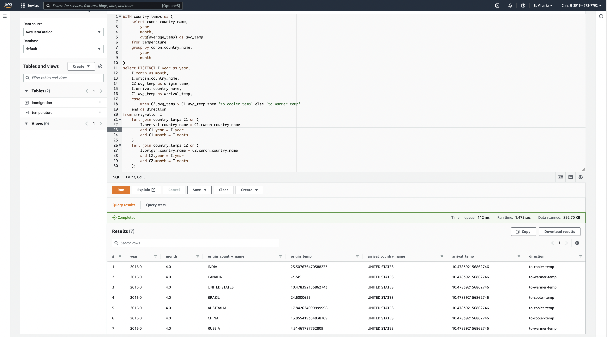


