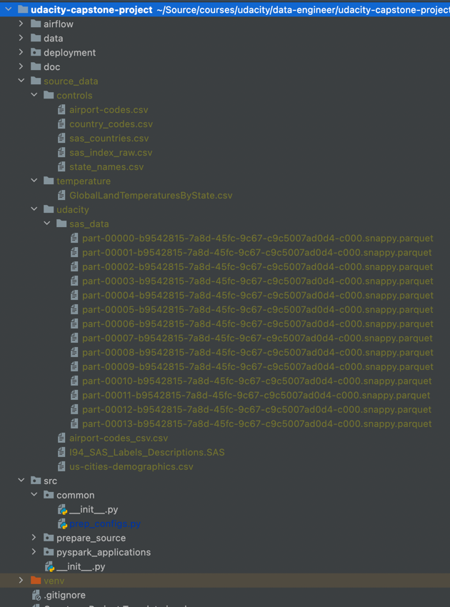

## Contents of this repository

| PATH         | SUBDIR                | DESCRIPTION                                                                           |
|:-------------|-----------------------|---------------------------------------------------------------------------------------|
| airflow/     | dags/                 | Airflow DAGS that initialize EMR and process pyspark steps from raw to processed      |
|              | job_flow_overrides/   | for the create EMR task                                                               |
|              | emr_steps/            | steps for the pyspark master                                                          |
|              | scripts/              | helper functions to pre-format yaml/json inputs from configurations                   |
| source_data/ |                       | raw csv, and sas data used to create a curated raw dataset                            |
|              | controls/             | small tables of geo-location data to augment the existing data                        |
|              | temperature/          | raw Global temperature data                                                           |
|              | udacity/              | raw i94immigration data from Udacity                                                  |
| data/        |                       | This is data that is created by the pyspark prepare and application code              |
|              | raw/                  | pre-processed data from source_data that we will use as hypothetical "input" data     |
|              | processed/            | This is th transformed dataset run locally - the same code we will upload to EMR      |
| deploy/      |                       | CDK scrips that create AWS Airflow, VPC's Buckets, and uploads data to the s3 buckets |
|              | scripts/              | assorted deployment scripts to upload the raw dataset to s3                           |
|              | src/                  | CDK source code                                                                       |
|              | tests/                | Work in progress                                                                      |
| doc/         |                       | documentation of this solution                                                        |
|              |                       |                                                                                       |
| src/         |                       | pyspark code to prepare, and execute the solution                                     |
|              | common/               | configuration code                                                                    |
|              | prepare_source/       | the code we run to get the 'raw' dataset that we will process in AWS                  |
|              | pyspark_applications/ | the code to transform from raw to processed data - uploaded to s3 by CDK              |

---

## Contents not in Github
The initial truly raw data is too big to store in Github, so I am taking a quick snapshot here.   I can provide this data if it is needed.

