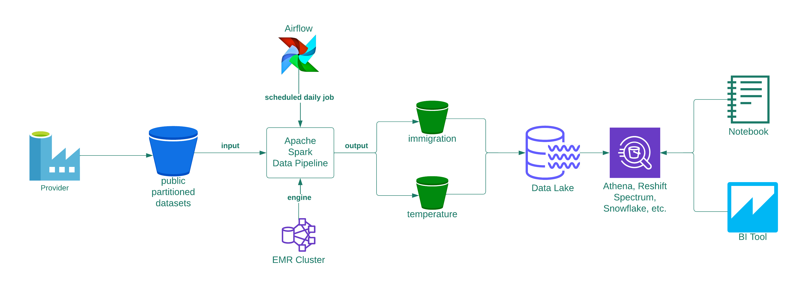

# Data pipeline architecture

The Immigration/Temperatures pipeline consists of the following:
- Data is provided as by imaginary `Providers` as partitioned csv datasets in public s3 `public-partitioned-datasets` bucket

--- 

---

- `Apache Airflow` is used to schedule and manage workflow

---

- The Airflow Dag runs Apache Spark data pipeline - which contains two pyspark processes:
  - ingest_immigration.py
  - ingest_temperature.py
- The pipeline appends new data to a private s3 bucket containing parquet data

---

- Storage is organized as `Data Lake` tables

--- 

- The data ab SQL can be managed by many database manaegment engines, incuding:
  - Snowflake
  - Athena
  - Redshift Spectrum
  - Apache Spark

---

- BI Tools, such as Tableau can bring either the full dataset or the resuts of a SQL query into the tool
- Notebooks, such as Jupyter and Zepplin can use Apache Spark or Flink to research the data

