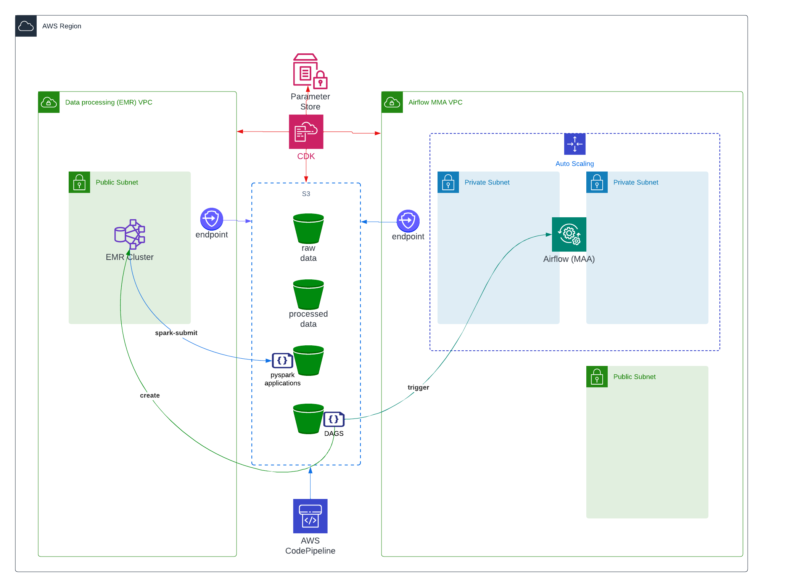

# Deployment

---

### CDK deployment
- [x] create the EMR VPC

- [x] create data buckets and upload code
  - `raw-bucket` -- holding the curated input data for immigrations and temperatures
  - `processed-bucket` -- destination for final processed data
  - `application-data` -- pyspark application files
  - upload pyspark_applications to the `application-data` bucket

- [x] create a separate `airflow-bucket` for airflow dags
  - upload dags to the airflow bucket

- [x] create a separate `VPC` for Airflow

- [x] create an `AWS managed Airflow` instance in the airflow VPC

### Setup Steps
1. Copy all really-raw source data to source_data/ - we are going to create more periodic raw data from these
2. Run pyspark scripts in src/prepare_source to load control data and to pre-process immigration and temerature data
3. Verify that the scripts in src/pyspark_applications are able to create the processed data locally
4. copy the "raw" directories to a raw directory in s3

### Deployment Steps
1. run the cdk scripts to VPS, airflow, s3 buckets, ssm parameters, etc.
   - CDK also copies small files such as dags/ pyspark_applications/ etc. to the right s3 bucket
   - Airflow points to an s3 bucket for dags
2. login to Aiflow and trigger the dags  

### CDK deployment
- [x] create the EMR VPC

- [x] create data buckets and upload code
  - `raw-bucket` -- holding the curated input data for immigrations and temperatures
  - `processed-bucket` -- destination for final processed data
  - `application-data` -- pyspark application files 
  - upload pyspark_applications to the `application-data` bucket

- [x] create a separate `airflow-bucket` for airflow dags
  - upload dags to the airflow bucket

- [x] create a separate `VPC` for Airflow

- [x] create an `AWS managed Airflow` instance in the airflow VPC

---

### Scripts
- [x] Upload the curated RAW immigration and temperature data to the raw-bucket
- [x] (incude a process to empty buckets before asking CDK to remove them)

